# 校门

各位游客朋友，咱们现在所处的位置，就是首都师范大学本部的正门啦，它也叫校本部主入口，是学校最主要、最具标志性的入口，也是咱们校园的“门面”所在。它位于北京市海淀区西三环北路105号，紧挨着西三环北路辅路，整体设计庄重典雅又简约大气，搭配深色的铁艺围栏和一旁的绿植点缀，既凸显了师范院校的沉稳气质，又不失校园的生机与活力，完美融合了师范院校的办学底蕴与青春气息。大家可以看一下，校门主体采用浅色石材砌筑，搭配深色的铁艺大门，大门上方悬挂着“首都师范大学”六个金色大字，字体端庄有力，辨识度极高，远远就能清晰看到。正门入口处设有两个对称的安保岗亭，里面配备了专业的安保人员，负责校园的出入管理、安全巡逻和咨询引导工作，一会儿大家要是有路线想问、或者需要办理入校登记，都可以去岗亭咨询咱们的安保人员，他们都会耐心为大家解答；咱们来访的游客、校友，也需要在安保岗亭登记身份信息、说明来访事由后，才能入校，这样也是为了保障咱们校园的安全与有序。

来，大家顺着我手指的方向看，在正门的左侧，有一栋被爬山虎完全覆盖的低层建筑，整个墙体都被翠绿的藤蔓紧密缠绕着，远远望去，就像一个规整的绿色方框，是不是还特别像《我的世界》里的方块建筑？造型特别别致、辨识度超高，也是咱们校园里热门的拍照打卡点之一。等到秋天的时候，这爬山虎的叶子会慢慢褪去翠绿，变成金灿灿的黄色，部分叶片还会泛出淡淡的红晕，和灰色的墙体、周边的松柏绿植相互映衬，风一吹，叶片轻轻摇曳，就像一幅极具诗意的校园秋景画，到时候大家一定要来这里拍几张照片留念哦。

现在，咱们从正门踏入校园，脚下这条宽阔平整的路，就是校园的主干道了。主干道两侧种着高大的白杨树和冬青灌木，四季常青、错落有致，大家走在这条路上，就能感受到咱们校园特有的静谧氛围。接下来，我给大家整理一下清晰的行进指引，方便大家快速找到自己想去的地方：主教学楼（一教/二教）在主干道正前方，从正门直走约50米就能到达；图书馆在正门左转，沿主干道步行约3分钟，途经校园绿植景观带即可到达；学术报告厅在图书馆南侧，步行约5分钟就能到；体育馆和操场在校园西侧，从正门直行、左转经过理科楼后，步行约8分钟可达；学生食堂在主教学楼北侧，步行约5分钟，紧挨着学生宿舍区域，就餐十分便捷；家属区则在校园西南侧，沿主干道直行、右转经过后勤服务中心后，步行约10分钟就能到达。

除了校内的方位指引，咱们正门周边的校外交通和配套也特别便利，方便大家出行和休闲。大家出门右转，沿着西三环北路向北步行约10-15分钟，就能到达首都师范大学的北一区、北二区，这两个校区和咱们本部紧密相连，部分校园资源也是共享的；向南步行约8分钟，就能到紫竹院公园，园内绿植繁茂、湖水清澈，是咱们师生课余休闲、散步放松的好去处，大家逛完校园，也可以去那里转一转；向西步行约12分钟，是玲珑公园，公园里有古塔、绿植和健身步道，环境特别清幽；向东步行约5分钟，就是花园桥地铁站，这里是地铁6号线和9号线的换乘站，周边还有多个公交站点，多条公交线路途经，不管大家想去市区哪个区域，出行都特别便捷。

作为校园的“门面”，这里不仅是师生们日常出入校园的必经之地，也是学校举办重大活动、迎接贵宾、接待校友返校的重要场所。每到开学季，这里都会挤满前来报到的新生和送学的家长，充满了热闹的氛围；到了毕业季，这里又会成为毕业生们合影留念的首选地，大家都会在这里定格自己的青春瞬间，带着学校的期望，奔赴人生的新征程。从这里踏入校园，大家就能感受到浓厚的学术氛围和温馨的校园气息，也正式开启咱们对首都师范大学本部的探索之旅。接下来，大家可以看一下旁边的图片，感受一下不同角度下校门的美景。

大家再看校门的两侧，对称分布着绿植景观带，里面种植着冬青、松柏、月季等绿植，四季常青、四季有花，不管是春天、夏天，还是秋天、冬天，这里都有不一样的美景，为校门增添了不少生机与美感；入口处还设有两个对称的安保岗亭，里面配备了专业的安保人员，负责校园的出入管理、安全巡逻、咨询引导等工作，咱们来访的游客、校友，都需要在安保岗亭登记身份信息、说明来访事由后，才能入校，这样也是为了保障咱们校园的安全与有序。

作为校园的“门面”，这里不仅是师生们日常出入校园的必经之地，也是学校举办重大活动、迎接贵宾、接待校友返校的重要场所。每到开学季，这里都会挤满前来报到的新生和送学的家长，充满了热闹的氛围；到了毕业季，这里又会成为毕业生们合影留念的首选地，大家都会在这里定格自己的青春瞬间，带着学校的期望，奔赴人生的新征程。从这里踏入校园，大家就能感受到浓厚的学术氛围和温馨的校园气息，也正式开启咱们对首都师范大学本部的探索之旅。接下来，大家可以看一下旁边的图片，感受一下不同角度下校门的美景。

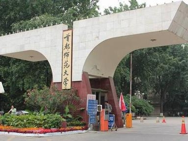

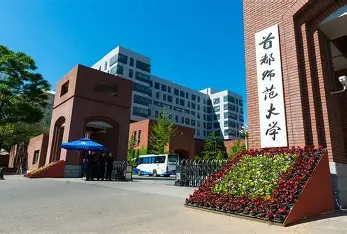

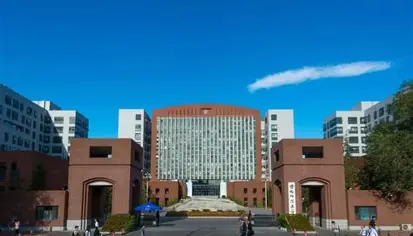

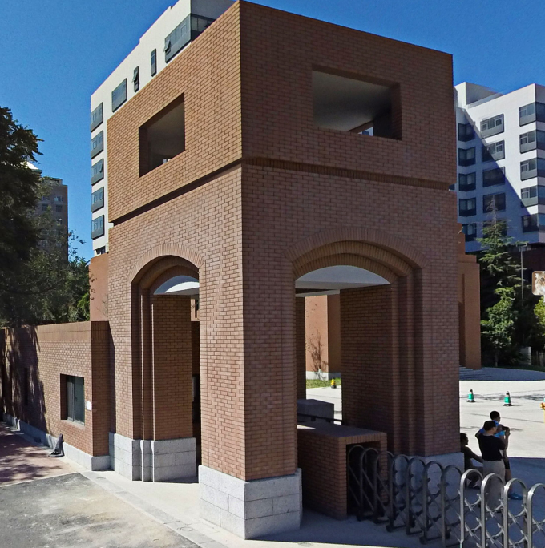

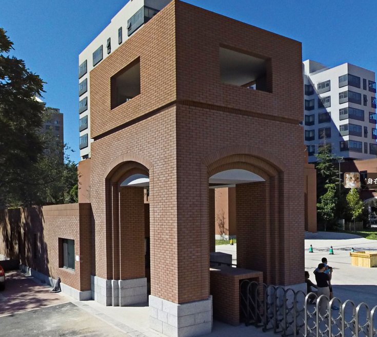

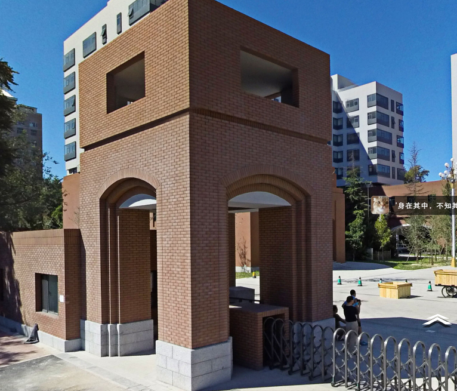

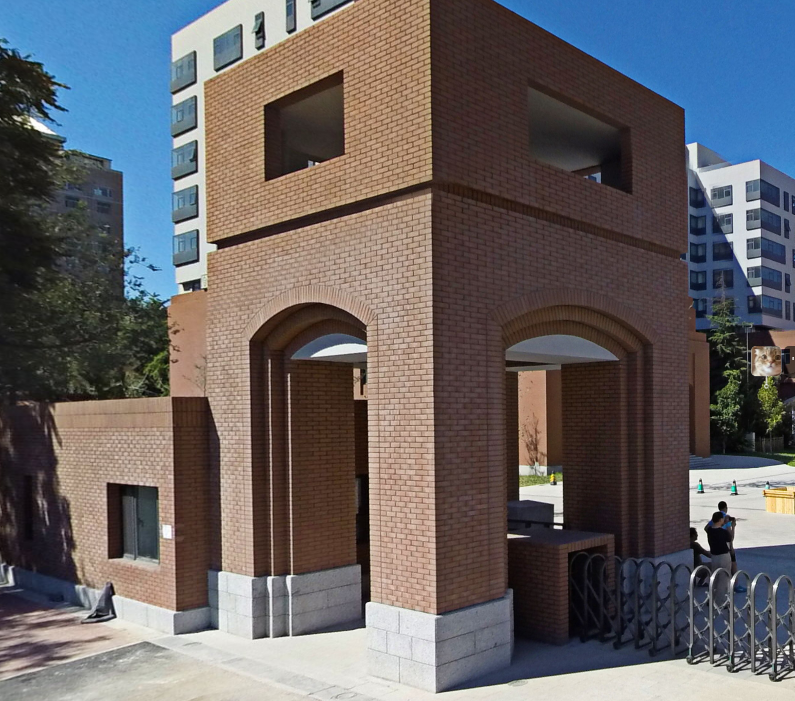

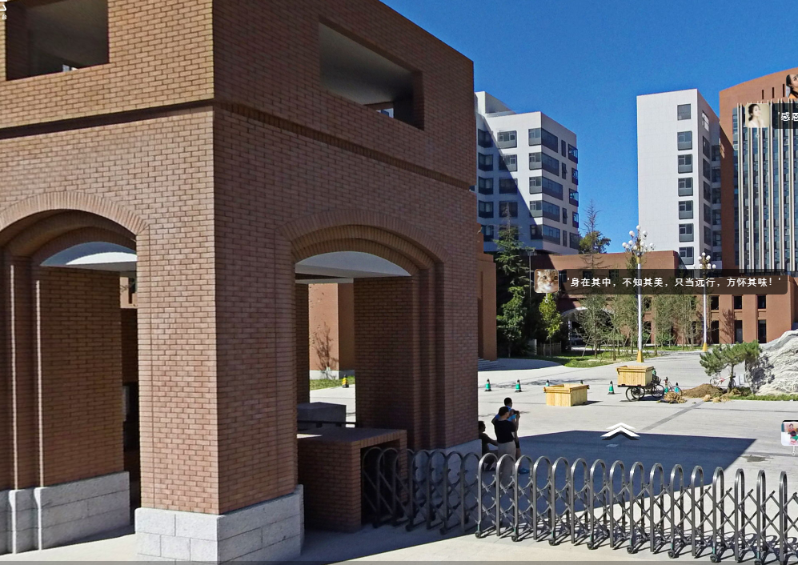

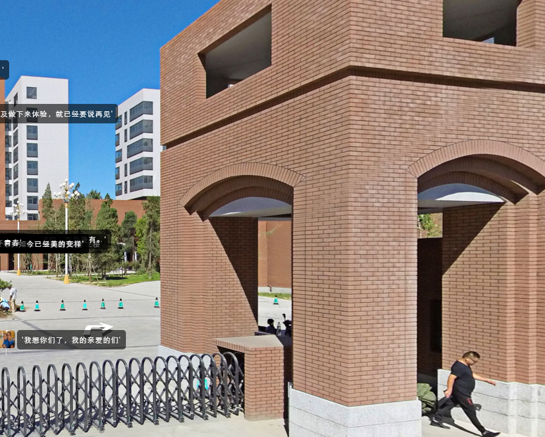

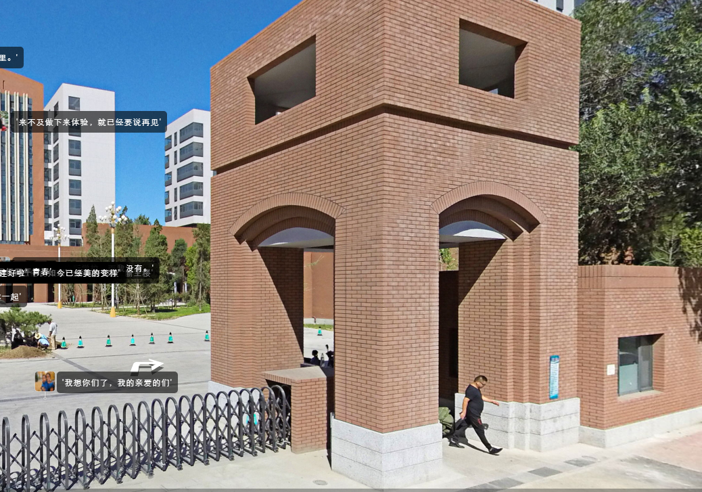

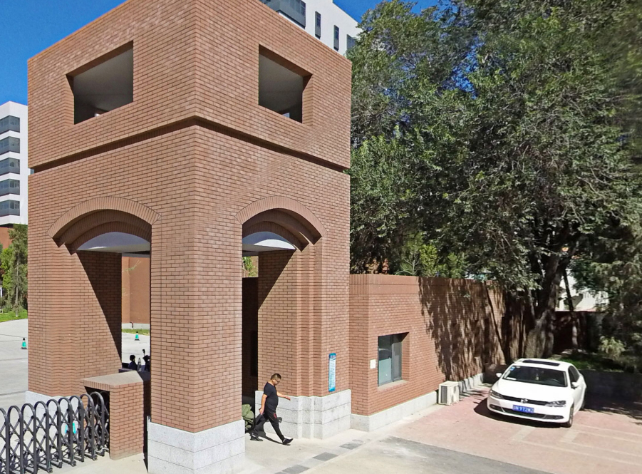

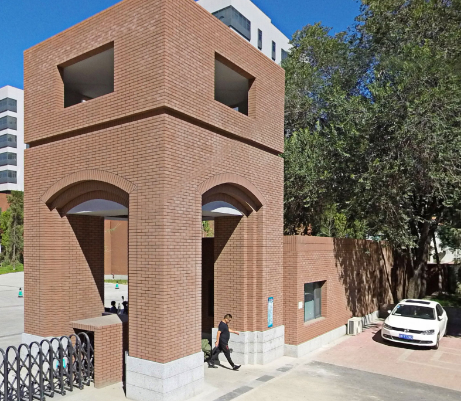

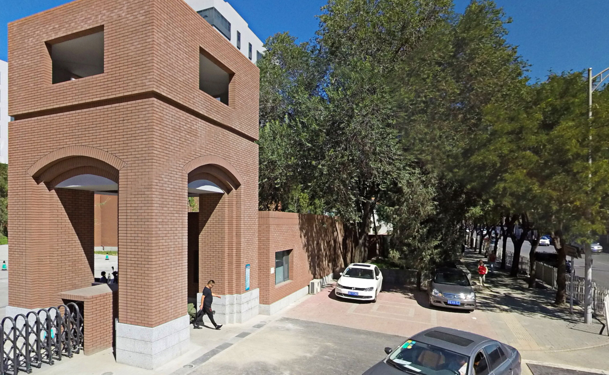

# 校训石

各位游客朋友，现在咱们来到的这个地方，就是咱们校园内极具象征意义的人文景观——校训石了。大家看，它位于校园正门主干道的核心位置，紧挨着主教学楼，地理位置特别显眼，不管是从正门进来，还是从主教学楼出来，都能一眼看到它。这块校训石，选用的是一块巨大的天然花岗岩，质地坚硬、色泽沉稳，整体造型简约大气，没有经过过多的雕琢，保留了石材本身的自然质感，这也正彰显了咱们学校“求实”的治学态度和沉稳的办学理念。

大家再看校训石的正面，用金色字体镌刻着咱们首都师范大学的校训——“为学为师、求实求新”，这八个大字端庄有力、熠熠生辉，远远望去就能清晰可见，它时刻提醒着咱们每一位首师大人，要牢记校训精神、践行办学理念。其中，“为学为师”这四个字，彰显了咱们学校作为师范院校的办学特色，它强调，咱们的师生既要潜心治学、求知求真，努力提升自己的学识素养，也要修身立德、为人师表，肩负起教书育人的神圣使命；而“求实求新”，则体现了咱们学校的治学精神，要求咱们的师生，要秉持严谨务实的态度，脚踏实地、求真务实，同时也要勇于探索、勇于创新，不断提升自身的素养和学校的办学水平。

大家看，校训石周边环绕着整齐的绿植景观，种植着冬青、月季、麦冬等绿植，还搭配了小型景观灯，既美化了周边的环境，也让校训石更具观赏性。每到开学季，学校都会在这里开展新生入学教育，老师们会给新生们讲解校训的内涵，引导新生们牢记校训、践行校训，开启自己的大学生活；到了毕业季，毕业生们也会纷纷来到校训石前合影留念，将校训精神铭记于心，带着学校的期望，奔赴人生的新征程。此外，平时的时候，也有很多师生来这里拍照、驻足沉思，校训石就像一位无声的老师，潜移默化中传递着学校的精神文化，凝聚着咱们全体首师大人的归属感和认同感。接下来，大家可以看一下旁边的图片，感受一下校训石的魅力。

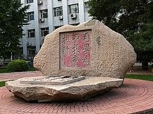

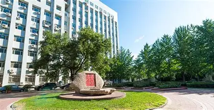

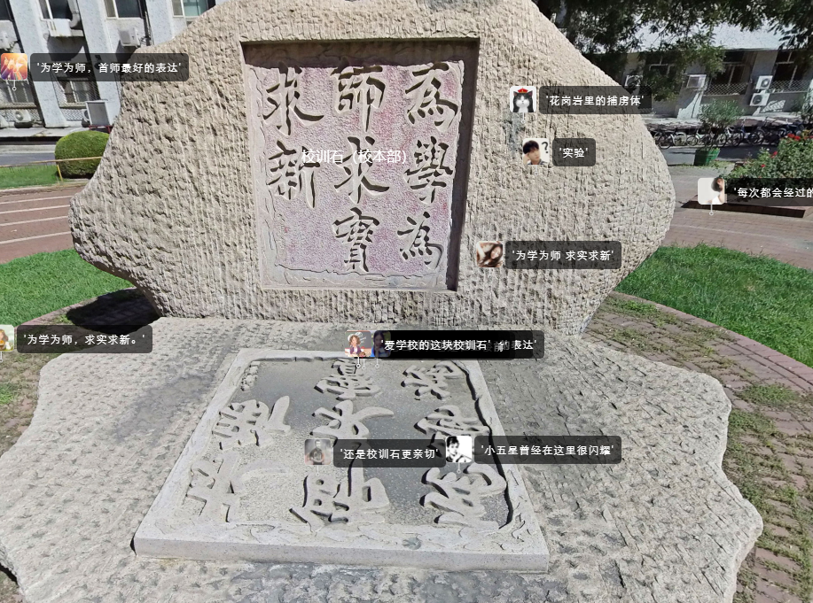

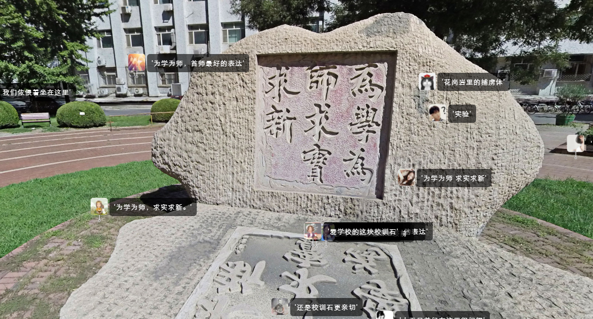

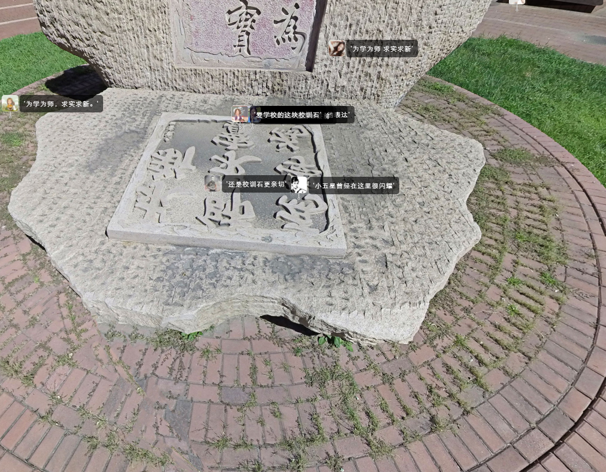

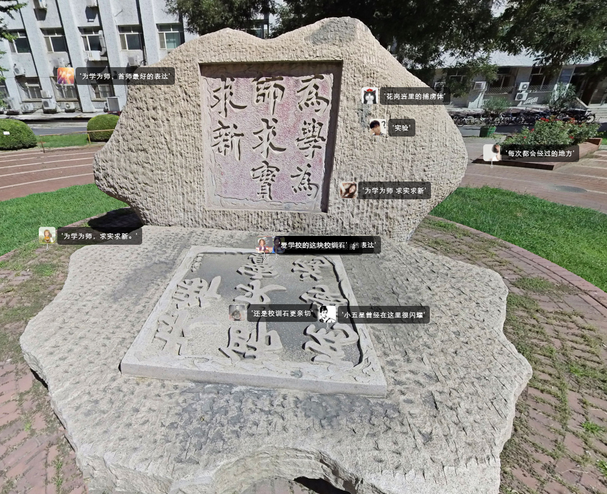

# 主楼

各位游客朋友，现在咱们来到的，就是首都师范大学校本部的核心建筑之一——主楼了。大家看，它位于校园的中部区域，紧挨着校训石和主教学楼，外观恢宏大气、庄重大气，整体采用的是对称式设计，色调以浅色为主，搭配深色的窗框，线条简洁流畅，既彰显了咱们学校的深厚底蕴，又符合现代校园建筑的审美风格。主楼一共有多个楼层，建筑面积非常广阔，涵盖了办公、展览、教学辅助等多种功能，是咱们学校行政管理、历史展示、学术交流的重要场所，平时学校的很多重要工作，都是在这里开展的。

咱们走进主楼，就能感受到它内部的宽敞明亮，布局科学合理，功能分区也特别明确。一层大厅宽敞明亮，设有咨询台和校园导览图，一会儿大家要是有路线想问、或者需要办理相关事宜，都可以去咨询台咨询；大厅两侧，还悬挂着咱们学校的办学理念、发展历程简介和优秀师生事迹展示，大家可以在这里，快速了解咱们学校的办学特色和育人成果。主楼的核心区域，就是设在内部核心楼层的校史馆，馆内面积广阔、陈列丰富，通过文字、图片、实物、视频等多种形式，全面展示了咱们首都师范大学从建校至今的发展历程、办学成就、师资力量、学科建设、校园文化等内容，堪称咱们学校的“历史博物馆”。

走进校史馆，大家就能看到里面陈列着大量珍贵的历史文物、老照片、毕业证样本、科研成果展品、名人题词等，从咱们学校的前身院校发展，到如今的学科建设、人才培养、科研创新等方面，全方位展现了学校的成长与辉煌。大家漫步在这里，仿佛能穿越时光，感受到学校一路走来的艰辛与不易，感受到一代代首师大人的坚守与奋斗。校史馆是免费向咱们师生、校友和来访游客开放的，平时还会定期安排志愿者进行讲解，大家要是想更深入地了解学校的历史，就可以找志愿者帮忙。这里也是咱们师生了解学校历史、传承学校精神，校友重温青春记忆，游客感受学校文化底蕴的重要场所。

此外，主楼内还设有多个学校行政管理部门的办公区域，像校长办公室、教务处、人事处等，咱们师生平时办理各类行政业务，都是在这里；同时，里面还设有多个小型会议室、学术研讨室，用于开展各类小型学术会议、行政会议、工作研讨等活动；楼内还配备了电梯、饮水区、卫生间等配套设施，通行和办公都特别便利。整个主楼的氛围，庄重有序，到处都充满了人文气息和学术氛围，也彰显了咱们学校的办学实力。接下来，大家可以看一下旁边的图片，感受一下主楼的恢宏气势。

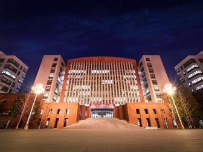

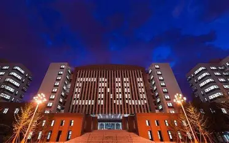

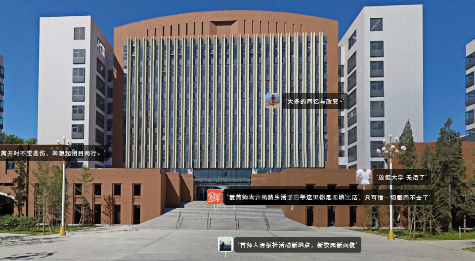

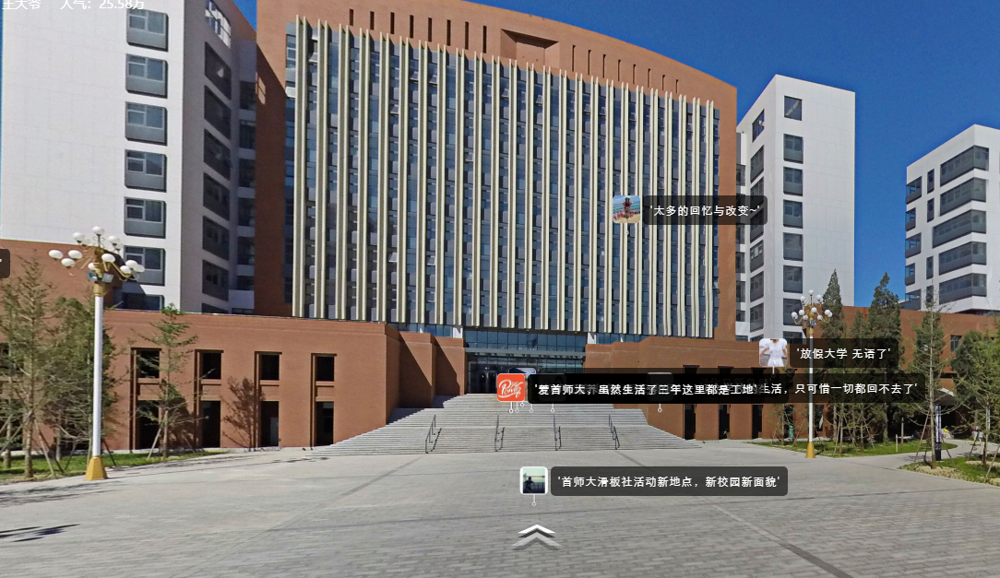

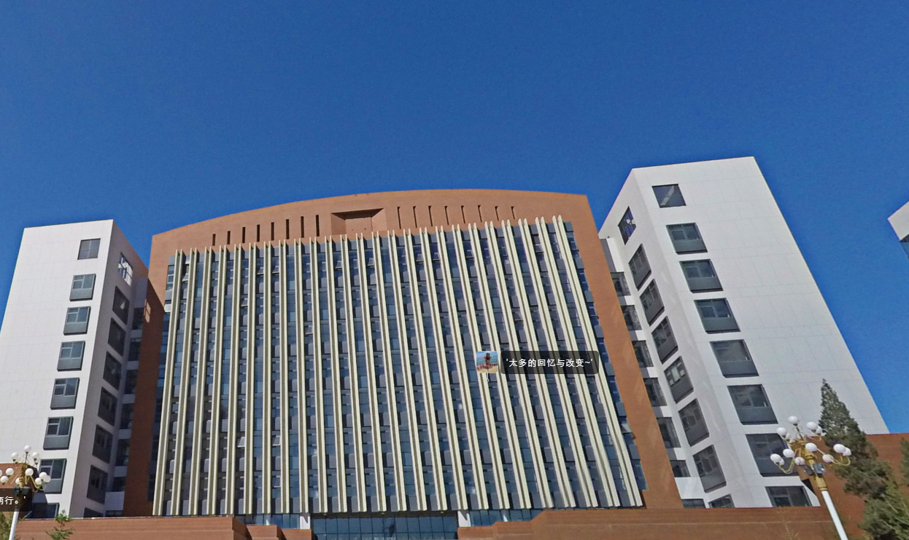

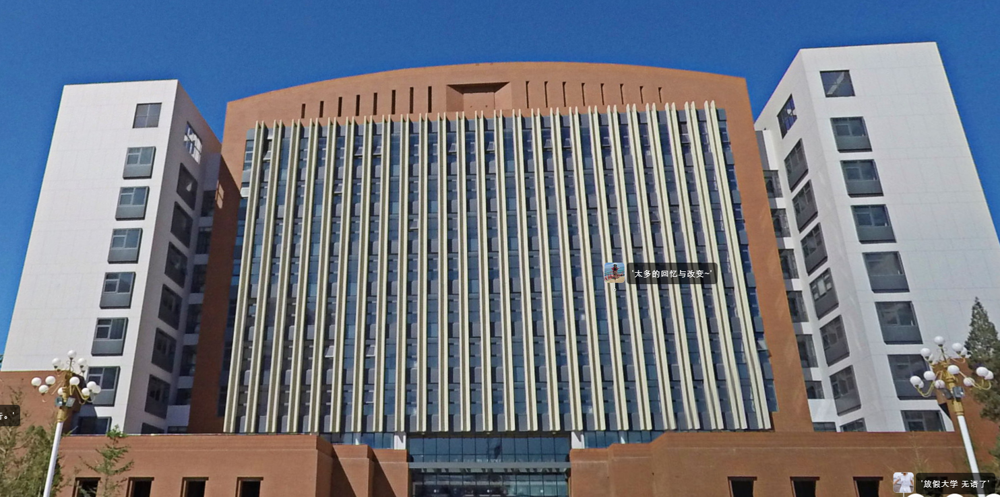

# 图书馆

各位游客朋友，现在咱们来到的，就是咱们校本部的图书馆了，它位于校园正门左转的主干道旁，紧挨着学术报告厅，是咱们学校的文献信息中心，也是师生们学习、科研、学术交流的核心场所之一。大家看图书馆的外观，简约大气，呈长方形布局，色调和校园内其他建筑保持一致，整体风格沉稳雅致，再加上周边的绿植景观相互映衬，营造出了一种宁静清幽的学习氛围，特别适合静下心来读书、学习。图书馆的馆舍面积约为7800平方米，一共有多个楼层，内部空间宽敞明亮，通风良好，布局科学合理，功能分区明确，能满足不同师生的学习和科研需求。

咱们图书馆的馆藏资源，可是极其丰富的，截至2024年底，一共有各类文献1692万余册（件），涵盖了图书、期刊、报纸、学位论文、电子文献、数据库等多种类型，覆盖了哲学、法学、文学、历史学、教育学、理学、工学、艺术学等多个学科领域。其中，教育类、文史类、艺术类的文献资源尤为丰富，这也贴合了咱们学校的办学特色和学科优势，为师生们的教学、学习和科研，提供了充足的文献支撑，不管大家想找什么类型的资料，基本都能在这里找到。

咱们图书馆实行的是分层管理，每个楼层的功能都不一样，这样也方便大家快速查找和使用资源，接下来我就给大家介绍一下各楼层的主要功能：

- 一层：主要设有历史博物馆和借阅服务台。历史博物馆位于一层的东侧，面积广阔，里面陈列着大量珍贵的历史文物、化石、古籍复印件等，涵盖了不同历史时期的文化遗产，还分为古代文明展区、近代历史展区、民俗文化展区等多个展区，是免费向咱们师生和来访游客开放的，大家可以在这里了解历史、传承文化，感受中华历史的博大精深；借阅服务台位于一层大厅的中央，配备了专业的工作人员，负责图书的借阅、归还、续借、检索、咨询等服务，咱们师生凭校园卡，就可以办理图书借阅手续，同时里面还设有自助借阅机、自助还书机，大家可以快速办理相关业务，节省时间。

- 二层：主要以开放的学习空间为主，设有多个自习区域，摆放着整齐的桌椅、书架和沙发，还分为固定自习区、临时自习区和小组研讨区，能满足不同师生的学习需求。固定自习区，可供师生长期占用学习，很多同学都会在这里固定自习；临时自习区，适合师生临时驻足学习，比如大家课间休息、或者来图书馆查资料，就可以在这里临时坐一会儿；小组研讨区，还配备了桌椅和白板，方便同学们开展小组讨论、课题研讨等活动；除此之外，二层还设有期刊阅读区，里面陈列着各类最新的期刊、报纸，师生们可以在这里阅读报刊、查阅期刊资料，了解行业动态和学术前沿。

- 三层及以上：主要是图书借阅区和电子阅览室。图书借阅区，是按学科分类陈列各类图书的，标识特别清晰，大家可以根据自己的专业和需求，快速找到所需的图书；电子阅览室，配备了大量高性能电脑，接入了校园高速网络，提供各类电子文献、数据库的检索和使用服务，师生们可以在这里查阅电子图书、电子期刊、学位论文等资源，同时也可以使用电脑进行文档编辑、论文撰写、在线学习等。

此外，咱们图书馆内还设有饮水区、卫生间、储物柜等配套设施，为大家提供便利；馆内环境安静整洁，严禁喧哗，营造出了浓厚的学习氛围，每天都有大量的师生来到这里自习、查阅资料、撰写论文，称得上是咱们校园内最具学习氛围的场所之一。而且图书馆还会定期开展各类读书活动、文献检索培训、图书展览等活动，丰富师生们的精神文化生活，提升师生们的文献检索和利用能力。接下来，大家可以看一下旁边的图片，感受一下图书馆的学习氛围。

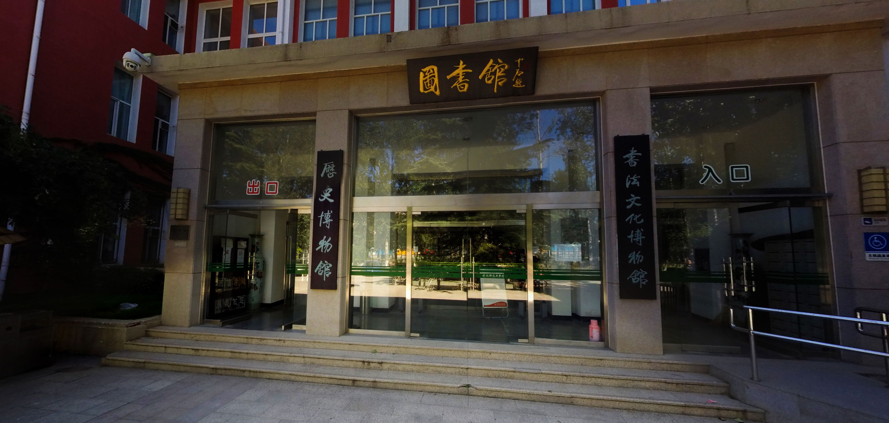

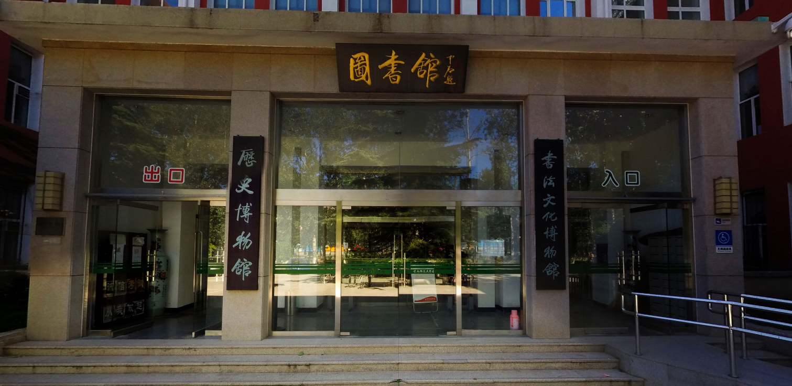

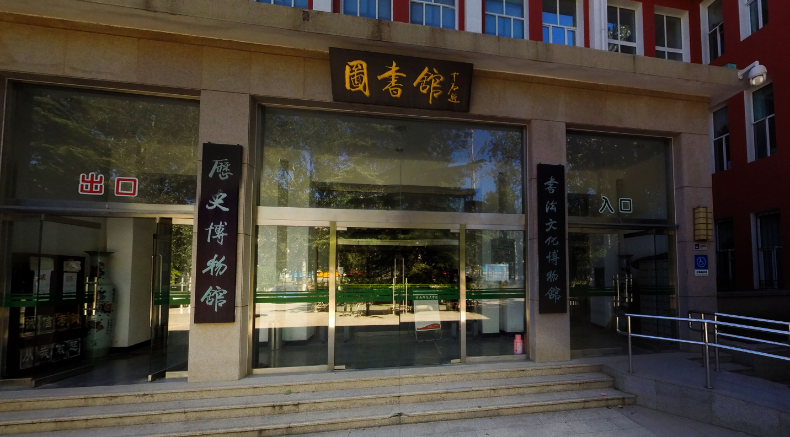

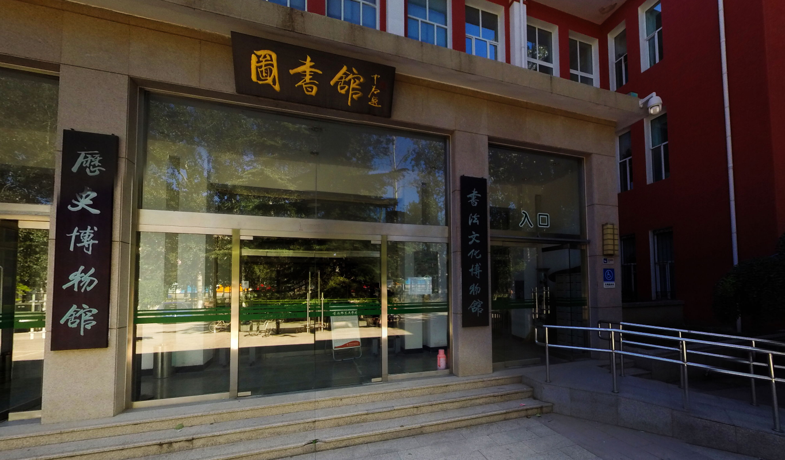

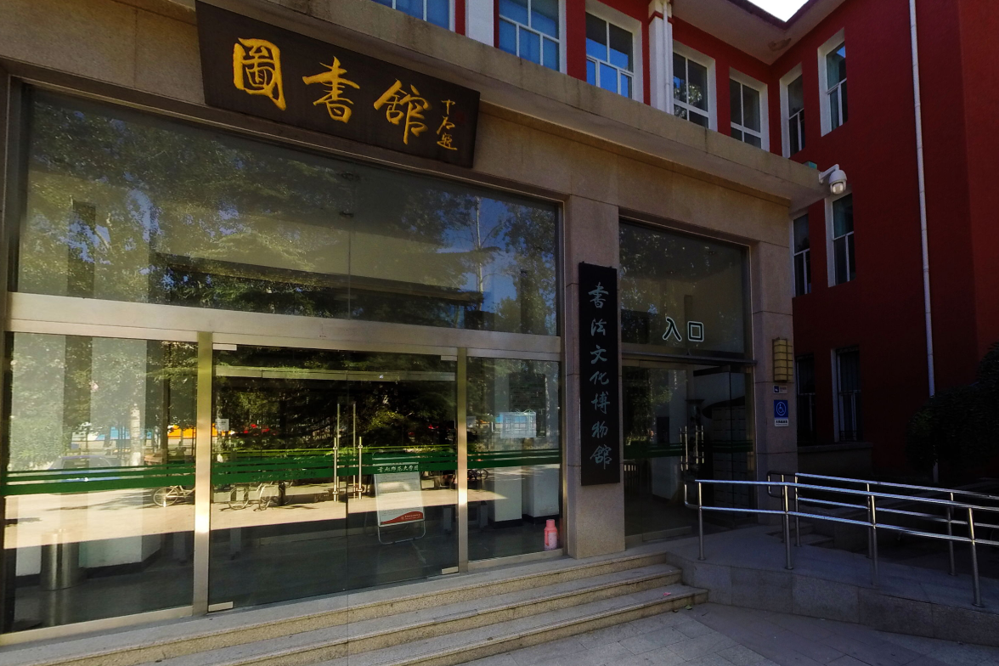

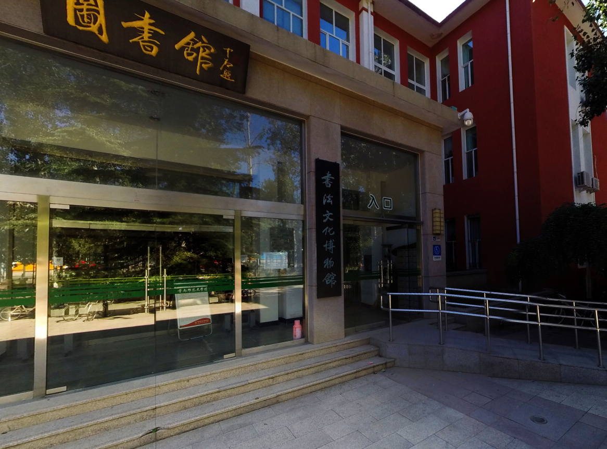

# 理科楼

各位游客朋友，现在咱们来到的，就是咱们校本部的理科楼了，它位于校园的西侧，紧挨着操场和图书馆，是咱们校本部理科专业师生教学、实验、科研的核心场所。大家看理科楼的外观，简约现代，色调沉稳，楼层比较高，还配备了多部大型电梯，方便师生们上下通行；楼体周边种植着大量绿植，环境特别清幽，远离了校园主干道的喧嚣，为理科教学和实验，提供了一个安静、舒适的环境，毕竟理科实验和学习，最需要的就是安静。

理科楼内部的设施，可是非常齐全、设备也很先进，涵盖了多个学科的实验室、标本馆、教学教室、科研办公室等，主要服务于数学、物理、化学、生物、地理、计算机等理科专业的师生，为同学们的实验学习、技能训练和老师们的科研工作，提供了坚实的保障。楼内每层都设有实验室和教室，标识特别清晰，布局也很合理，不同学科的实验室分类明确，互不干扰，这样也能避免实验过程中相互影响。

实验室可以说是理科楼的核心区域了，各类实验室都配备了先进的实验设备、仪器仪表和实验耗材，能满足不同专业的实验教学和科研需求。比如物理实验室，里面配备了示波器、显微镜、分光计等各类物理实验仪器，同学们可以在这里开展力学、热学、光学、电磁学等各类基础物理实验和专业物理实验；化学实验室，里面设有通风橱、实验台、试剂柜等，配备了各类化学试剂和实验仪器，同学们可以在这里开展无机化学、有机化学、分析化学等各类化学实验，同时学校也特别注重实验安全，里面配备了消防设施、急救药品等，保障师生们的实验安全；生物实验室，配备了生物显微镜、培养箱、离心机等设备，同学们可以在这里开展细胞培养、微生物实验、动植物标本制作等实验活动；地理实验室，则配备了地理信息系统、地图绘制设备等，助力同学们开展地理研究和实践活动。

除了实验室，理科楼内还设有多个标本馆，其中最具特色的，就是生物标本馆和地理标本馆了，里面陈列着大量珍贵的动植物标本、矿物标本、岩石标本等，种类丰富、保存完好。生物标本馆内，陈列着鸟类、兽类、昆虫类、植物类等各类标本，形态逼真，同学们可以在这里直观地观察和学习，了解不同生物的形态特征和生活习性；地理标本馆内，陈列着各类矿物、岩石、化石等标本，能帮助同学们直观了解地理环境和地质构造，提升对地理学科的认知和理解，比在课本上学习，更加直观、生动。

此外，理科楼内还设有多个教学教室和研讨室，用于开展理科专业的理论教学、习题讲解、科研研讨等活动；楼内还配备了饮水区、卫生间、储物柜、实验器材存放室等配套设施，为师生们提供便利；同时学校还设有专门的实验管理员，负责实验室的管理、设备维护、实验耗材发放等工作，保障实验室的正常运行。每天，理科专业的同学们都会在这里上课、做实验，老师们在这里开展科研工作，整个理科楼，都充满了严谨务实的治学氛围和积极探索的科研精神。接下来，大家可以看一下旁边的图片，感受一下理科楼的环境和设施。

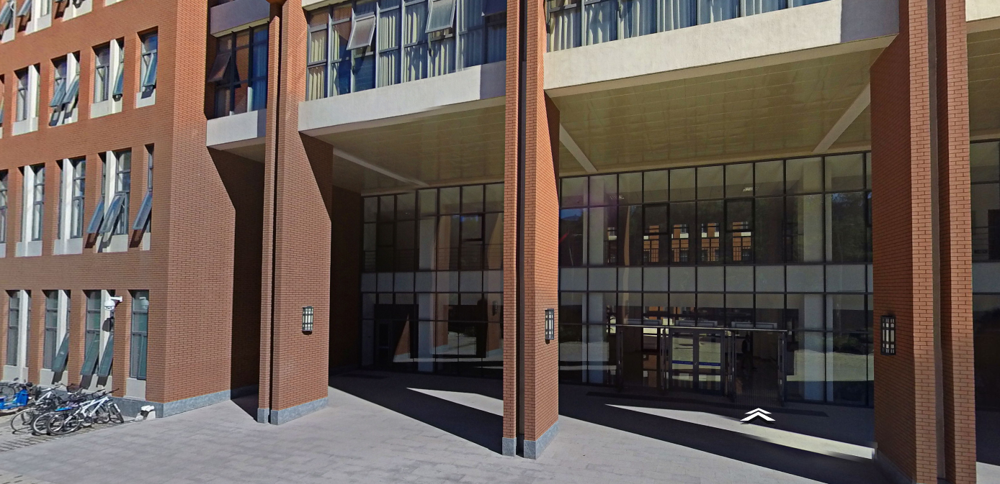

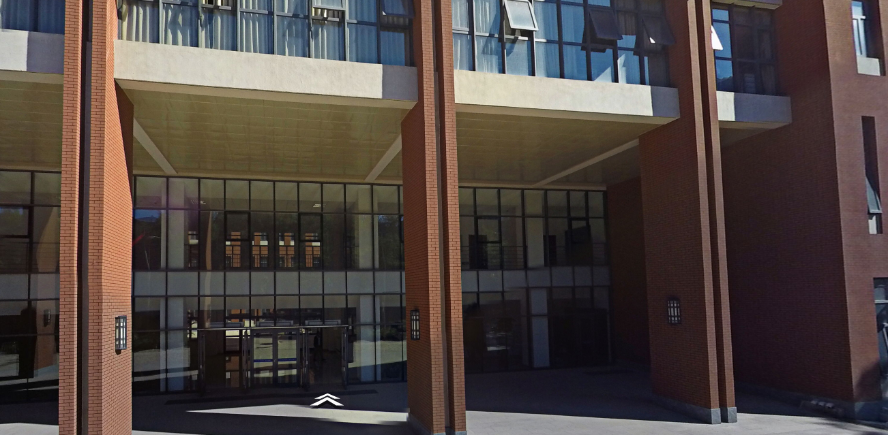

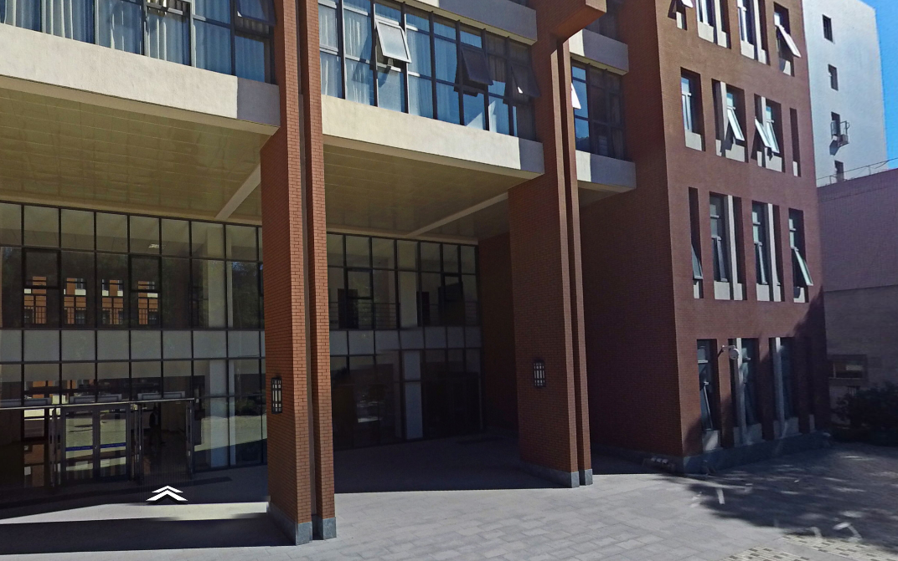

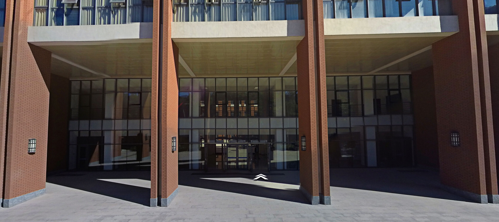

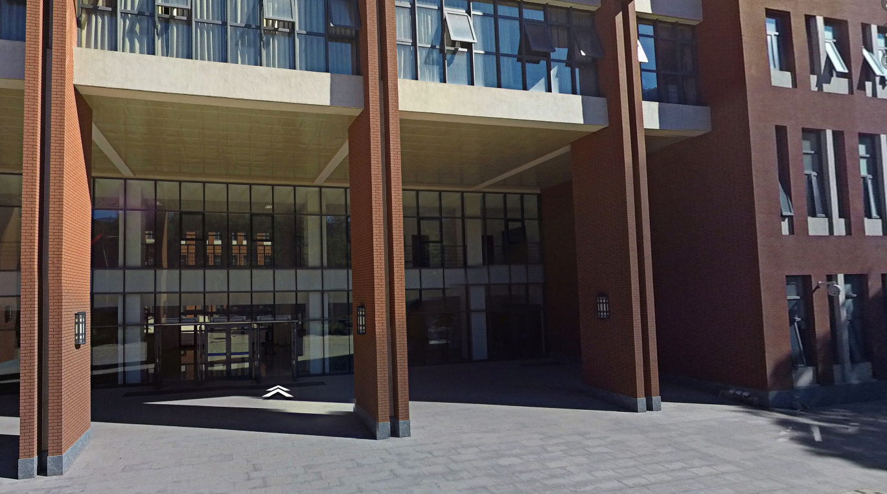

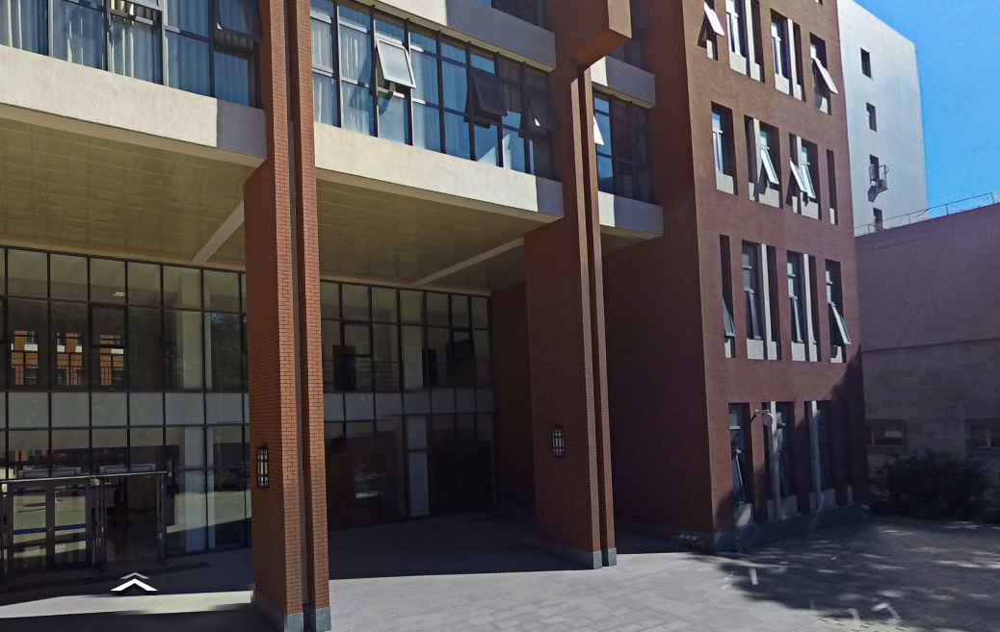

# 学生活动中心（补充版）

各位游客朋友，现在咱们来到的，就是首都师范大学本部的学生活动中心了，这里可是咱们同学们课余生活的核心场所，不管是社团活动、艺术实践，还是休闲放松，同学们都爱来这里，也是咱们校园里最具烟火气和活力的角落之一。它位于校园的中部区域，紧挨着篮球场和大操场，地理位置特别优越，周边交通也很便利，外观简约现代，色调柔和，内部装修温馨舒适，到处都充满了青春活力与创意气息，每天都有大量的同学在这里开展各类活动，接下来我就带大家全面了解一下这个充满青春气息的地方。

咱们这个学生活动中心，功能特别丰富多样，涵盖了艺术展示、社团办公、休闲娱乐、实践交流等多个领域，能全方位满足同学们的课余生活需求。其中，最有特色的就是二层的猫咖了，这里不仅是同学们休闲放松、撸猫解压的好去处，同时也是各类小型文化活动的举办场地，平时经常会在这里承办音乐会、小型话剧表演、民谣分享会、社团汇报演出等活动，为同学们提供了一个欣赏艺术、展示自我、交流互动的优质平台。猫咖里面环境整洁温馨，配备了舒适的座椅、书架和饮品区，同学们可以在这里一边和可爱的猫咪互动，一边享受悠闲的课余时光，缓解学习和生活的压力，大家有兴趣，也可以进去体验一下。

接下来，咱们重点看一下三层至四层，这里以“文化传承 + 艺术实践 + 协作办公”为核心定位，精心打造了16大特色场地，每个场地都有明确的功能定位和独特的装修风格，既实用又有观赏性，为同学们的艺术实践和文化交流提供了充足的空间，咱们一一来看。三层是人文艺术区，重点打造了非遗空间、棋艺天地、墨宝工坊、武夷茶舍四大特色场所，到处都彰显着浓厚的人文气息，主要是为了助力同学们传承中华优秀传统文化。大家跟我来，非遗空间室内布局雅致，陈列着古筝、二胡、琵琶、竹笛等多种传统乐器，配备了齐全的乐谱架和音响设备，专门用来开展非遗音乐教学、传统乐器排练等活动，运气好的话，大家还能看到同学们的精彩表演；棋艺天地装修简约古朴，摆放着木质棋桌和各类棋具，墙面悬挂着棋类文化海报，同学们经常来这里以棋会友、切磋棋艺；墨宝工坊内墨香四溢，整齐摆放着书画工具，四壁悬挂着同学们的书画作品，是练习书法、创作绘画的好地方，学校也会在这里举办书画比赛和展览；武夷茶舍古色古香，摆放着古木茶案和茶具，同学们可以在这里学习茶文化、练习茶艺、品茗论道，感受中华茶文化的深厚底蕴，大家也可以坐下来，品一杯清茶，放松一下身心。

看完了三层的人文艺术区，咱们再去四层的综合功能区，这里主要聚焦于社团办公、大型排练、活动推广等需求，设有新媒体宣传中心、合唱厅、道具室、社团办公室等多个场地。新媒体宣传中心配备了高性能电脑、相机、剪辑设备等，是校园各类活动推广的“幕后推手”，也是学校“林小团影音工作室”的核心阵地，同学们平时会在这里开展新媒体运营、视频剪辑、海报设计等工作，咱们网上看到的校园活动宣传，很多都是从这里诞生的；合唱厅内部宽敞明亮，铺设木质地板，摆放阶梯式座椅，声效设计专业，左侧配备专业钢琴，还有化妆间、休息区等配套，是学校合唱团和声乐社团排练、汇报演出的主要场地，平时也会举办小型合唱比赛；道具室设有整墙带锁木质柜子，分类存放活动道具、演出服装和舞台设备，柜子旁还专门陈列着升旗仪式用的长枪等物品，有专人负责道具的借用、登记和维护，为各类校园活动提供坚实保障。

大家可能刚才没注意，咱们学生活动中心的一层，设有大厅、接待台和小型活动场地。大厅宽敞明亮，摆放着舒适的座椅，同学们平时可以在这里休息、等候；接待台配备了工作人员和志愿者，负责活动报名、场地预约、咨询引导等工作，同学们要是想咨询社团相关事宜、预约活动场地，都可以来这里；小型活动场地，可用于举办小型社团招新、座谈会、手工活动等，灵活便捷，平时很多小型活动，都是在这里开展的。除了咱们刚才介绍的场地外，三层还设有小型展览区，主要用于展示同学们的艺术作品、手工作品、摄影作品等，方便大家相互学习、交流；四层还设有多个社团办公室，为文学社、美术社、音乐社等各类校园社团提供固定的办公和活动空间，助力社团更好地发展。

此外，大家看，咱们学生活动中心对面，就是篮球场和大操场，场地宽敞、设施齐全，同学们在活动之余，就可以去那里运动健身、放松身心；而且在活动中心附近，还设有清真食堂，装修整洁、菜品丰富，严格遵循清真饮食规范，能满足不同民族同学的饮食需求，让同学们在校园里就能感受到贴心的关怀。咱们学生活动中心，还会定期开展各类校园文化活动，比如校园文化节、社团嘉年华、文艺汇演、手工大赛等，每次活动都会吸引大量同学参与，丰富了同学们的课余生活，也营造了浓厚的校园文化氛围；活动中心内还设有卫生间、饮水区、储物柜等配套设施，整体环境干净整洁，有专人负责日常打扫和维护，让同学们能够在舒适的环境中，享受自己的课余时光。好了，学生活动中心就给大家介绍到这里，大家可以在这里自由参观一会儿，有任何问题，都可以问我。接下来，大家也可以看一下旁边的图片，感受一下学生活动中心的温馨氛围。

大家可能刚才没注意，咱们学生活动中心的一层，设有大厅、接待台和小型活动场地。大厅宽敞明亮，摆放着舒适的座椅，同学们平时可以在这里休息、等候；接待台配备了工作人员和志愿者，负责活动报名、场地预约、咨询引导等工作，同学们要是想咨询社团相关事宜、预约活动场地，都可以来这里；小型活动场地，可用于举办小型社团招新、座谈会、手工活动等，灵活便捷，平时很多小型活动，都是在这里开展的。

二层的猫咖，咱们刚才已经介绍过了，它是活动中心的特色区域之一，这里不仅有可爱的猫咪陪伴，还有温馨舒适的环境，配备了桌椅、书架、饮品区，同学们可以在这里撸猫解压、阅读休闲，也可以和朋友小聚聊天；同时，这里也是各类小型文艺活动的举办场地，经常开展音乐会、小型话剧、民谣演唱、诗歌朗诵等活动，为同学们提供了展示自我才华的平台，也丰富了同学们的课余文化生活，很多同学都特别喜欢来这里。

三层至四层的16大特色场地，咱们刚才也逐一了解了，它们各有侧重，兼顾实用性与趣味性，让同学们在课余时间，能够培养兴趣、提升素养、结交朋友。除了咱们刚才介绍的场地外，三层还设有小型展览区，主要用于展示同学们的艺术作品、手工作品、摄影作品等，平时同学们有优秀的作品，都会在这里展示，也能让大家相互学习、相互交流；四层还设有多个社团办公室，为各类校园社团提供了固定的办公和活动空间，方便社团开展日常工作、组织活动，像文学社、美术社、音乐社、志愿者协会等，都在这里设有专属办公区域，助力社团更好地发展。

此外，咱们学生活动中心，还会定期开展各类校园文化活动，比如校园文化节、社团嘉年华、文艺汇演、手工大赛等，每次活动都会吸引大量同学参与，丰富了同学们的课余生活，也营造了浓厚的校园文化氛围；活动中心内还设有卫生间、饮水区、储物柜等配套设施，为同学们提供便利，整体环境干净整洁，有专人负责日常打扫和维护，让同学们能够在舒适的环境中，享受自己的课余时光。接下来，大家可以看一下旁边的图片，感受一下学生活动中心的温馨氛围。

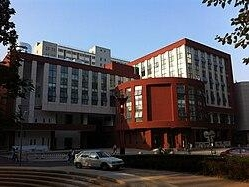

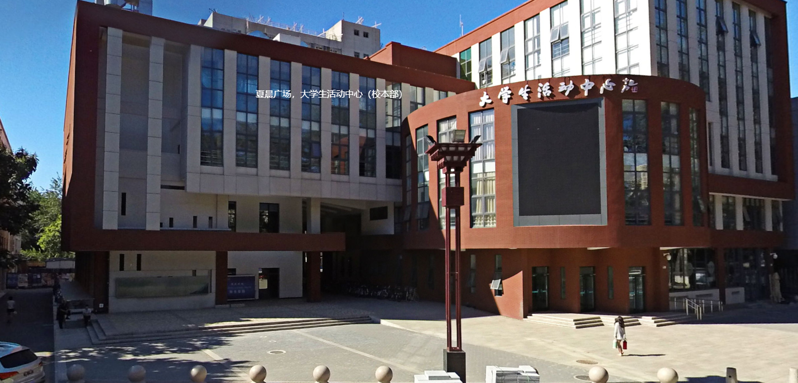

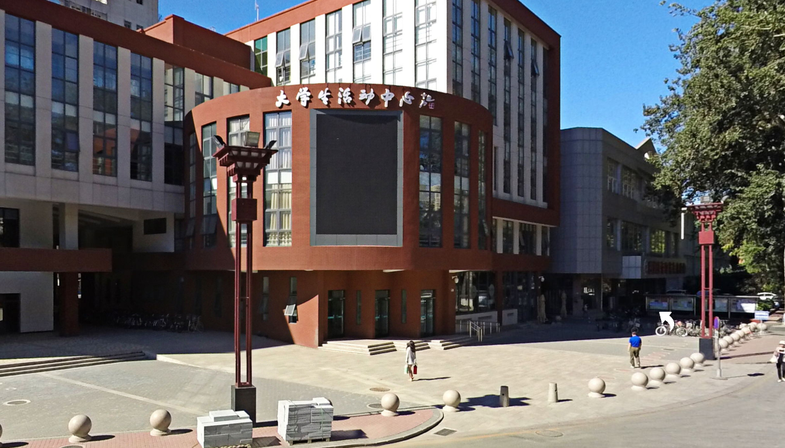

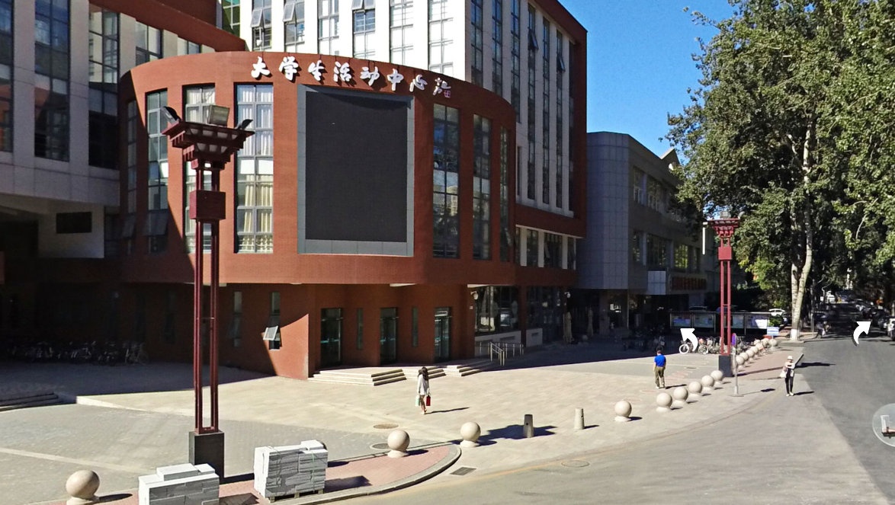

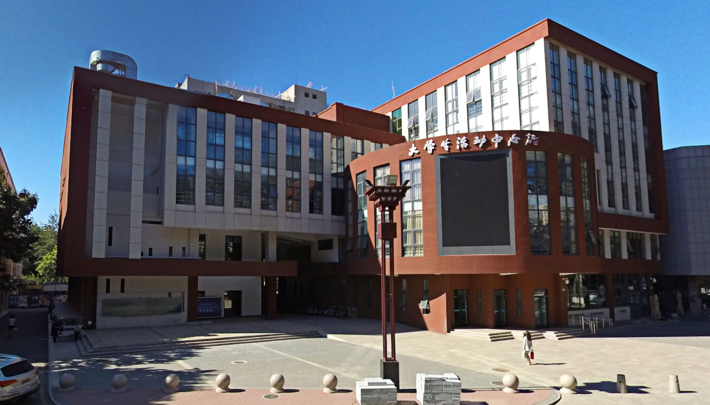

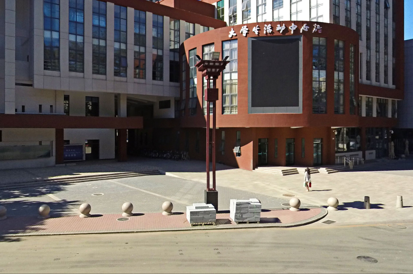

# 操场

各位游客朋友，现在咱们来到的，就是咱们校园内最具动感的地方——操场了。它位于校园的西侧，紧挨着理科楼和学生活动中心，整体面积广阔，设施齐全、布局合理，分为室外操场和室内体育馆两部分，既能满足大家户外锻炼的需求，也能满足室内运动的需求，每天都能看到师生们运动的身影，充满了青春活力，是咱们校园内最具动感的角落之一，大家逛累了，也可以在这里休息一下，感受一下校园的运动氛围。

室外操场，是最受师生们欢迎的区域，里面设有标准的400米塑胶跑道，大家可以感受一下，这个跑道质地柔软、弹性适中，跑步的时候，能有效缓解膝盖和脚踝的压力，减少运动损伤，特别适合日常锻炼；跑道内侧，是一片天然草坪足球场，草坪平整翠绿、养护良好，平时同学们会在这里开展足球比赛、户外体能训练等活动，每到周末，这里也会有很多同学来踢足球，氛围特别热闹；跑道外侧，分布着多个室外篮球场和排球场，场地铺设了防滑地面，配备了标准的球架和球网，设施完好，是同学们打篮球、打排球的首选场所，每天傍晚和周末，这里都会挤满运动的同学，欢声笑语不断，特别有青春气息。

大家看，操场周边设有看台和休息座椅。看台位于操场的东侧，能容纳数百人就座，平时学校举办校园运动会、体育比赛、升旗仪式等大型活动时，师生们都会在这里观看和就座，氛围特别热闹；休息座椅分布在操场的四周，方便师生们运动间隙休息、补水、交流，座椅周边种植着高大的树木，夏天的时候，树叶枝繁叶茂，能够遮挡阳光、乘凉避暑，为大家提供一个舒适的休息环境，冬天的时候，大家也可以在这里晒太阳、休息。

除了室外场地，操场旁边的体育馆，也为大家提供了充足的室内运动空间，有效解决了雨天、冬天等恶劣天气，大家无法户外锻炼的问题。体育馆内的设施，专业又齐全，设有室内篮球场、羽毛球场、乒乓球场、健身房等区域：室内篮球场地面平整、灯光充足，配备了专业的篮球架和计分设备，平时可以在这里开展篮球比赛、篮球训练等活动；羽毛球场和乒乓球场分区明确，配备了标准的球网和球台，适合师生们开展小型球类运动、日常锻炼；健身房内，配备了跑步机、哑铃、各类健身器材等，能满足师生们日常健身、体能训练的需求，而且健身房对师生是免费开放的，大家凭校园卡，就可以进入健身。

操场周边，还设有体育器材室，里面存放着各类体育器材，像篮球、足球、排球、羽毛球拍、乒乓球拍、跳绳、呼啦圈等，师生们可以凭校园卡借用，方便大家开展各类体育活动；同时，学校还设有专门的体育老师和器材管理员，负责操场和体育馆的管理、器材维护、安全保障等工作，保障大家的运动安全。此外，操场也是学校举办校园运动会、体育文化节、新生军训、户外拓展等活动的主要场所，每到运动会期间，这里都会热闹非凡，师生们齐聚一堂，展现自己的青春风采和拼搏精神，特别有感染力。接下来，大家可以看一下旁边的图片，感受一下操场的热闹氛围。

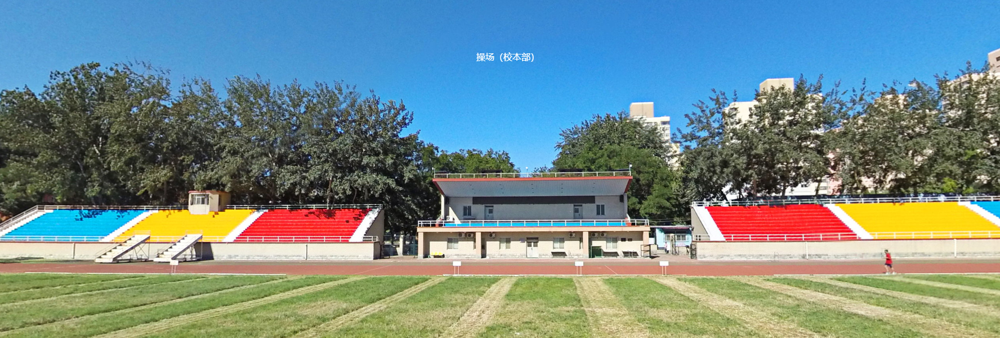

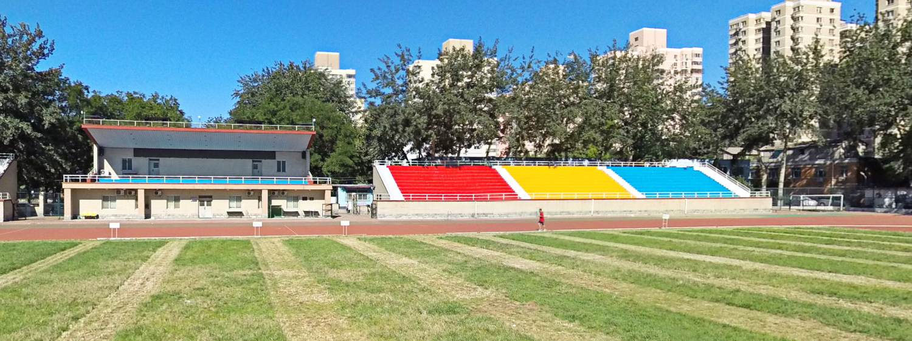

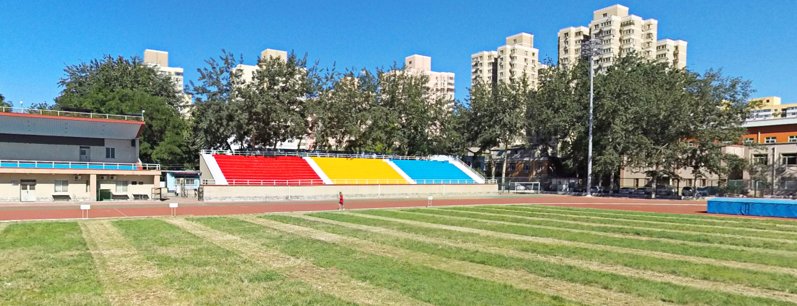

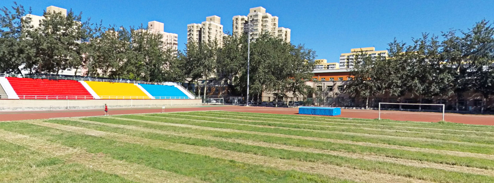

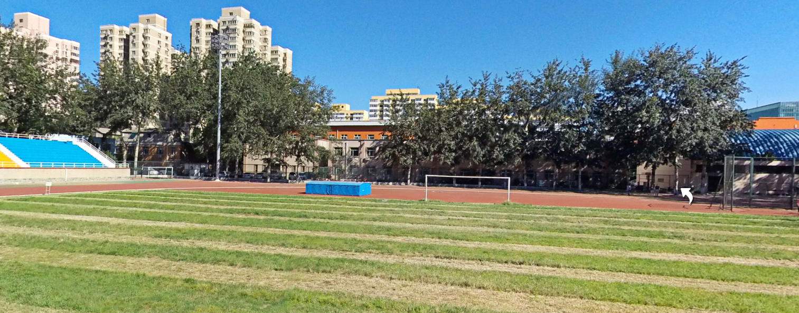

# 食堂

各位游客朋友，逛了这么久，大家肯定也有点饿了吧？接下来，我就带大家去咱们校本部的食堂看看，这里可是咱们师生们日常就餐的核心场所，能让大家感受到咱们校园的烟火气。食堂位于主教学楼（一教/二教）的北侧，紧挨着学生宿舍区域，地理位置特别便利，同学们下课、下自习后，步行几分钟就能到食堂就餐，不用跑太远。食堂整体建筑外观简约整洁，内部装修干净明亮、通风良好，一共分为两层，每层都有独立的就餐区和菜品区，配备了消毒设备、新风系统等，保障大家的饮食安全和就餐体验，食堂每天供应早、中、晚三餐，菜品丰富、价格实惠，不管大家是南方口味还是北方口味，都能在这里找到自己爱吃的饭菜。

咱们先来看一层，一层以基本伙食为主，主打性价比，菜品主要是家常菜、快餐，种类齐全、口味适中，特别贴合咱们师生的日常饮食需求。一层的菜品区，分为多个窗口，像主食窗口、素菜窗口、荤菜窗口、汤品窗口等，大家可以根据自己的需求，选择喜欢的菜品。主食窗口，供应米饭、馒头、花卷、包子、面条、粥类等多种主食，热气腾腾、种类丰富，不管大家爱吃什么主食，都能在这里找到；素菜窗口，供应各类时令蔬菜，新鲜可口、清淡健康，价格也很实惠，大多在2-5元之间，特别划算；荤菜窗口，供应猪肉、牛肉、鸡肉、鱼肉等各类荤菜，做法多样、肉质鲜嫩，价格在5-10元之间，性价比很高；汤品窗口，供应免费汤和特色汤品，免费汤每天都会更换，像番茄鸡蛋汤、紫菜蛋花汤等，特色汤品像鸡汤、鱼汤等，价格实惠、营养丰富，大家就餐的时候，都可以盛一碗汤，暖暖胃。

一层的就餐区，面积非常广阔，摆放着整齐的餐桌椅，能同时容纳数百人就餐，就餐区设有饮水区和餐具回收处，大家就餐后，记得将餐具送至回收处，保持就餐环境的整洁；而且一层还设有便利店，售卖饮料、零食、生活用品等，大家就餐之余，要是想购买一些小东西，也特别方便，不用特意跑到校外。

看完了一层，咱们再去二层看看，二层的环境，比一层更加新颖，装修风格简约时尚，和一层的简约风格有所区别，更受咱们年轻学生的喜爱。二层主要以自选菜和特色美食为主，兼顾多样性和特色化，能满足不同师生的个性化饮食需求。自选菜区域，菜品特别丰富，涵盖了荤菜、素菜、凉菜、小吃等，大家可以根据自己的口味，自由选择，按重量计费，灵活便捷，想吃多少选多少，不浪费；特色美食区域，设有多个特色窗口，像云南美食窗口、麻辣香锅窗口、麻辣烫窗口、盖浇饭窗口等，其中云南美食窗口，主打云南特色菜品，像过桥米线、云南小锅米线、汽锅鸡等，口味独特、风味十足，深受同学们的喜爱，大家要是想尝尝不一样的口味，一定要来这个窗口试试。

二层的就餐区，设有普通餐桌椅和卡座，卡座区域的环境，特别温馨，适合同学们结伴就餐、聊天交流；同时，里面还设有小型休闲区，摆放着沙发和茶几，大家就餐后，也可以在这里休息、小聚，聊聊天、放松一下；二层还配备了空调和新风系统，冬暖夏凉，不管是冬天还是夏天，大家都能在这里舒适地就餐。

此外，咱们食堂，特别注重食品安全，严格遵循食品安全管理制度，食材统一采购、严格检验，确保食材新鲜、安全，大家可以放心食用；食堂的工作人员，都持健康证上岗，穿戴统一的工作服、工作帽和口罩，注重个人卫生和操作规范；食堂还会定期进行卫生打扫和消毒，保障就餐环境的干净整洁，让大家能够吃得放心、吃得安心。而且食堂还会根据节日和季节变化，推出特色菜品和节日套餐，像春节的饺子、中秋的月饼、夏天的凉面等，贴合节日氛围，让师生们在校园里，也能感受到家的温暖。接下来，大家可以看一下旁边的图片，感受一下食堂的环境和菜品。

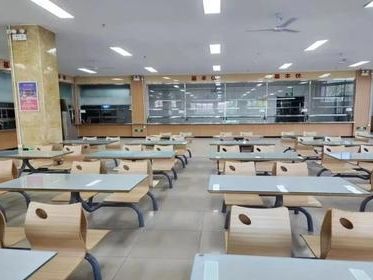

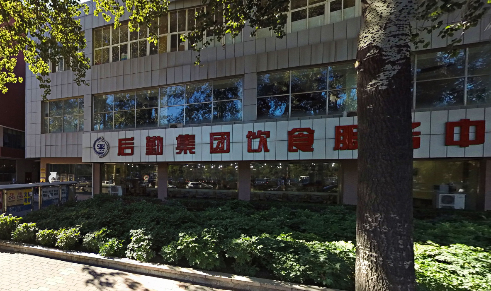

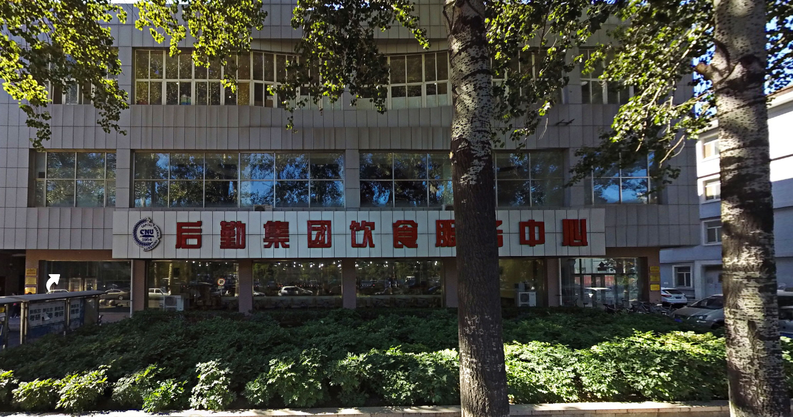

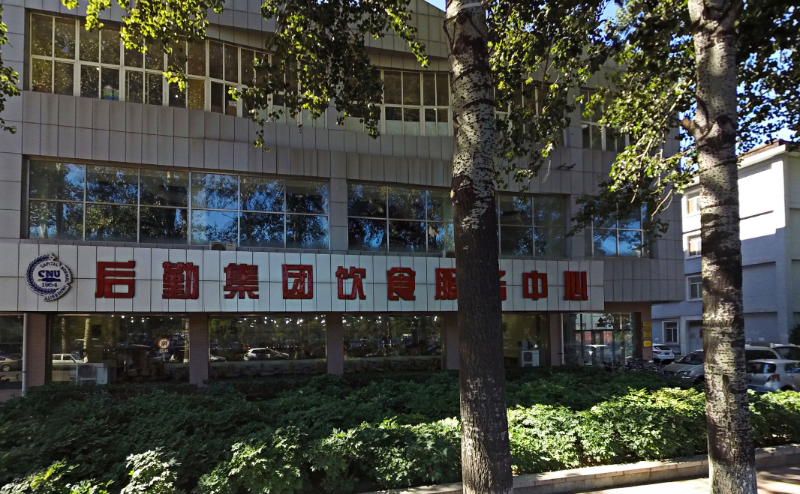

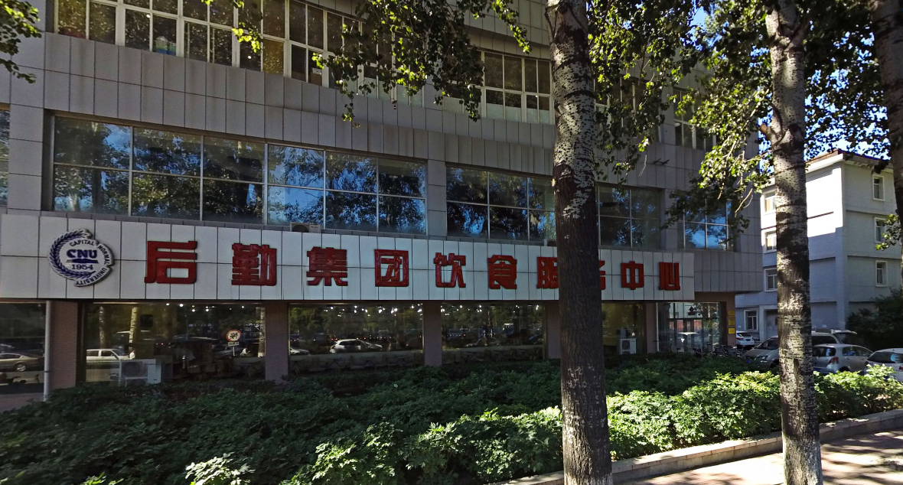

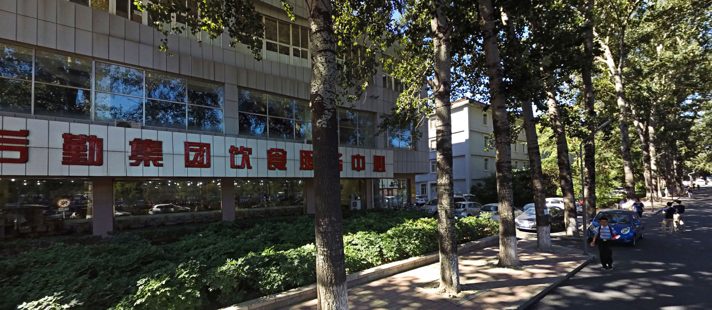

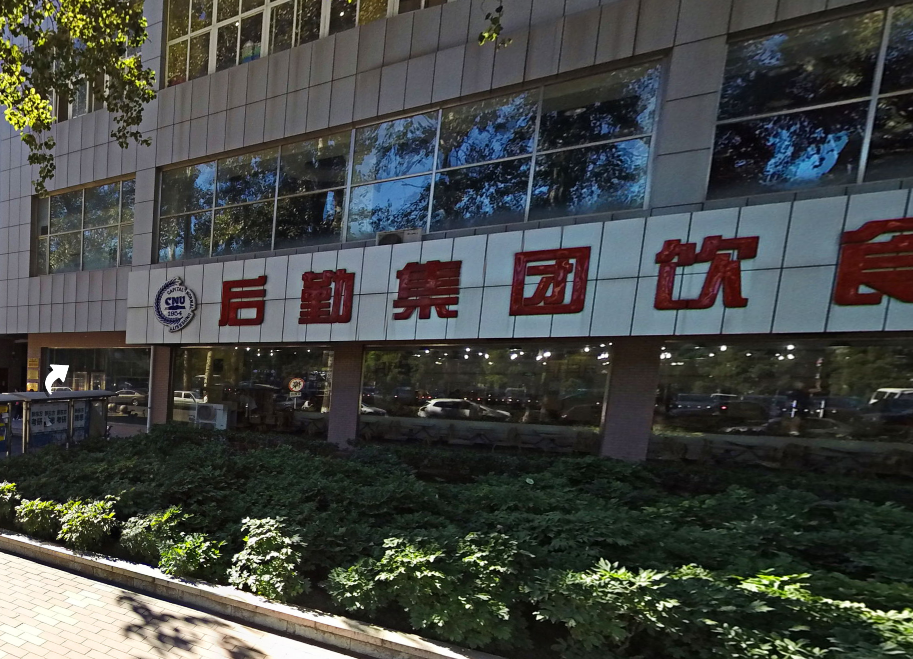

# 大成广场

各位游客朋友，现在咱们来到的，就是咱们校园内最具生活气息的休闲场所——大成广场了。它位于校园的中部区域，紧挨着图书馆和学生活动中心，整体面积广阔，布局规整，地面铺设了平整的石板，周边环绕着绿植景观和特色建筑，环境温馨舒适、氛围轻松惬意，是咱们同学们吃饭、自习、聊天、玩游戏、放松身心的好去处，也承载着许多首师大学子的青春记忆，很多同学的课余时光，都是在这里度过的。

大成广场的核心区域，是一片开阔的空地，地面干净整洁，没有过多的建筑遮挡，阳光特别充足，不管是冬天还是夏天，这里的阳光都很舒适。白天的时候，同学们常常在这里晒太阳、看书、聊天、玩桌游，偶尔也会有社团在这里开展小型招新、户外排练、公益宣传等活动，到处都充满了烟火气和青春活力；傍晚时分，广场上会聚集不少同学，有的结伴散步、有的聊天谈心、有的开展小型文体活动，氛围十分融洽，成为咱们校园内最温馨的角落之一，大家要是傍晚来这里，就能感受到这种温馨的氛围。

广场周边的配套，也特别齐全，分布着咖啡馆、书吧、便利店等场所，极大地满足了同学们的休闲和学习需求。咖啡馆环境温馨雅致，供应各类咖啡、奶茶、甜品等，同学们可以在这里喝咖啡、看书、自习、和朋友小聚，享受悠闲的课余时光，累了的时候，来这里喝一杯咖啡，放松一下，特别惬意；书吧内，陈列着各类书籍、杂志、报刊等，种类丰富，涵盖了文学、艺术、科普、娱乐等多个领域，同学们可以在这里免费阅读，也可以购买自己喜欢的书籍，书吧内还设有自习区域，摆放着桌椅，方便同学们在这里自习、查阅资料；便利店售卖饮料、零食、生活用品、文具等，方便同学们随时购买所需物品，十分便捷，不用特意跑很远。

广场周边的绿植景观，也十分优美，种植着高大的树木、冬青灌木、月季、海棠等绿植和花卉，四季常青、四季有花，每个季节都有不一样的美景。春天的时候，海棠花开、月季绽放，景色十分美丽，到处都充满了生机与活力；夏天的时候，树木枝繁叶茂，能够遮挡阳光、乘凉避暑，大家可以在这里乘凉、休息；秋天的时候，树叶金黄，落叶纷飞，充满了诗意，特别适合拍照留念；冬天的时候，松柏常青，点缀着冬日的校园，为广场增添了生机与美感。广场周边，还设有多个休息座椅，分布在绿植旁和咖啡馆、书吧门口，方便同学们休息、就座，座椅设计舒适，是同学们放松身心的好地方。

此外，大成广场，也是咱们校园内举办各类小型校园文化活动的重要场所，像小型音乐会、诗歌朗诵会、手工市集、校园招聘会等，活动期间，广场上热闹非凡，吸引大量师生参与，丰富了同学们的课余生活，也营造了浓厚的校园文化氛围。每到毕业季，毕业生们也会纷纷来到大成广场合影留念，在这里定格自己青春的美好瞬间，带着对校园的眷恋，奔赴人生的新征程；新生入学后，也会在这里熟悉校园、结交朋友，开启自己的大学生活。可以说，大成广场，承载了太多首师大学子的青春回忆，也见证了同学们的成长与蜕变。接下来，大家可以看一下旁边的图片，感受一下大成广场的温馨与美好。

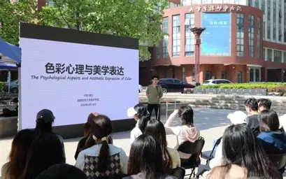

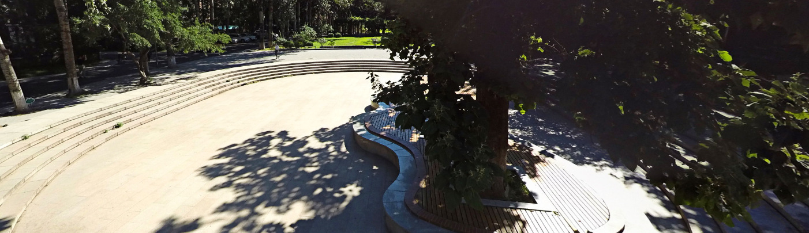

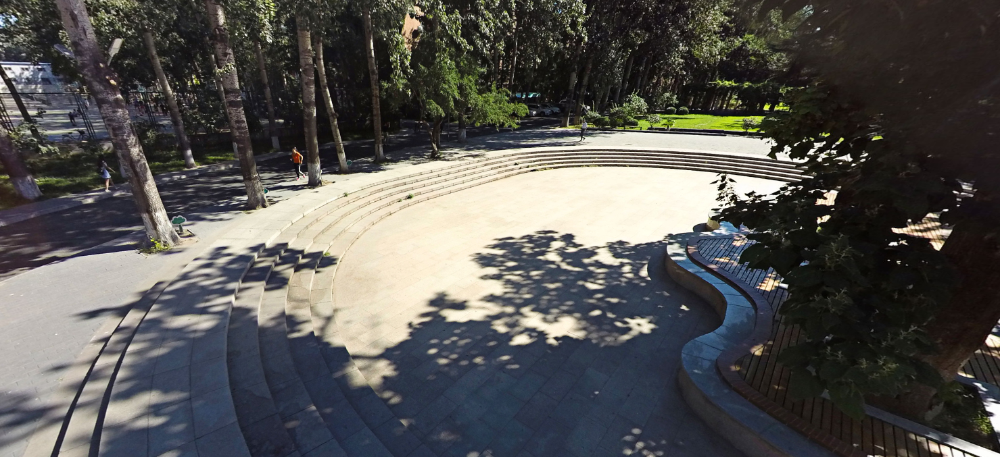

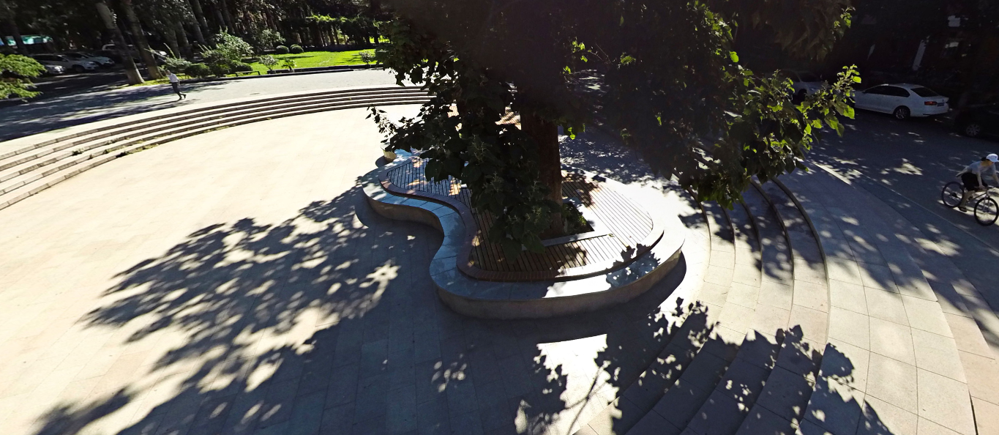

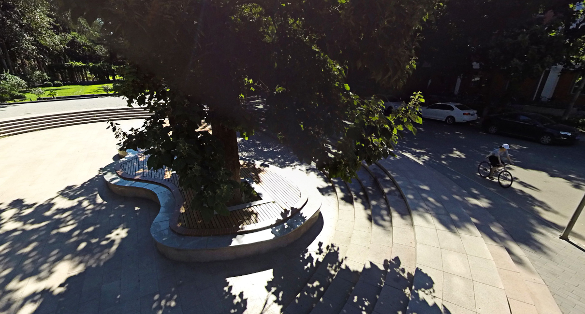

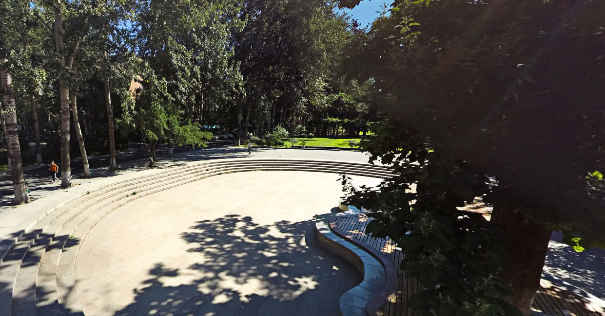
> （注：文档部分内容可能由 AI 生成）